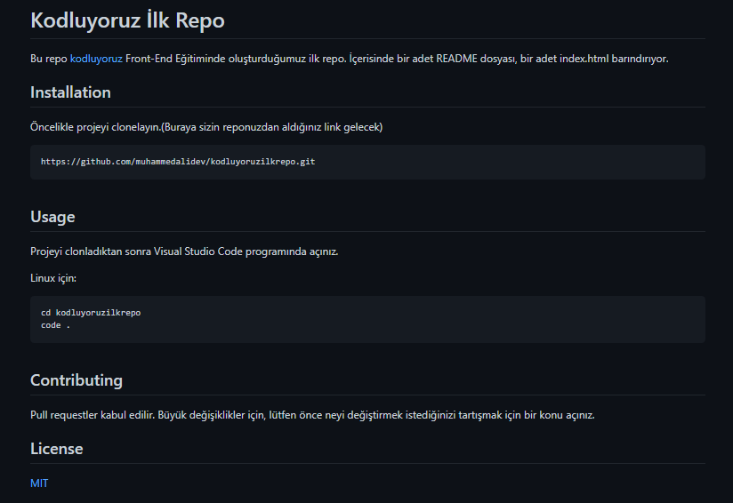

# Kodluyoruz İlk Repo


Bu repo [kodluyoruz](https://www.kodluyoruz.org/) Front-End Eğitiminde oluşturduğumuz ilk repo. İçerisinde bir adet README dosyası, bir adet index.html barındırıyor.

## Installation

Öncelikle projeyi clonelayın.(Buraya sizin reponuzdan aldığınız link gelecek)

```
https://github.com/muhammedalidev/kodluyoruzilkrepo.git
```

## Usage

Projeyi clonladıktan sonra Visual Studio Code programında açınız.
 
 Linux için:

 ```
 cd kodluyoruzilkrepo
 code .
 ```

 ## Contributing
 
 Pull requestler kabul edilir. Büyük değişiklikler için, lütfen önce neyi değiştirmek istediğinizi tartışmak için bir konu açınız.

 ## License
 
 [MIT](LICENSE)
